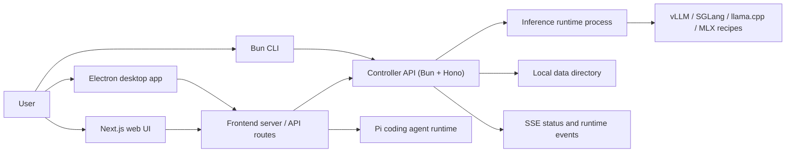
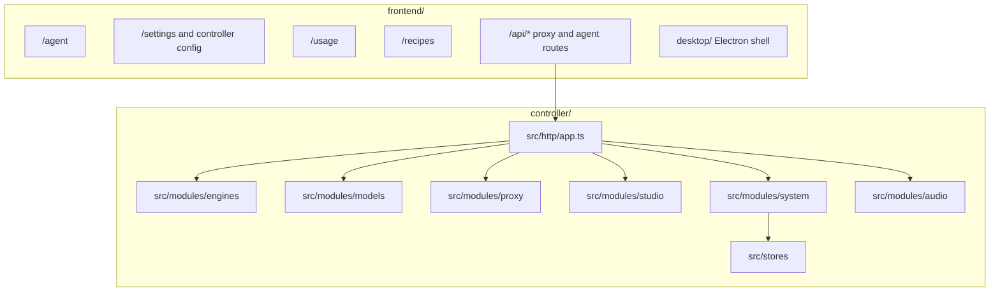

# vLLM Studio

vLLM Studio is a local-first workstation for running, managing, and using self-hosted LLM backends. It combines a controller API, a Next.js/Electron interface, and a small CLI so one machine can launch models, watch GPU/runtime state, chat with OpenAI-compatible endpoints, and run agent sessions against local or remote controllers.

## What Is A Controller?

A controller is the backend process that the UI and CLI talk to. In this repo it is the Bun/Hono server in `controller/`.

The controller owns:

- Model lifecycle operations such as launch, evict, status, recipes, downloads, and runtime process coordination.
- OpenAI-compatible proxy routes for chat, models, tokenization, audio, and related inference calls.
- System state such as GPU metrics, logs, usage data, controller settings, and server-sent events.
- Controller integrations used by the frontend and CLI.

You can run one controller locally or connect the frontend to a remote controller on a GPU host.

## Quick Start

Prerequisites:

- Bun 1.x (controller and CLI).
- Node.js 20+ and npm (frontend).
- Python 3.10+ on `PATH` (the controller creates engine virtualenvs with it). `uv` is strongly recommended; engine installs fall back to pip, which is much slower.
- Git.
- For vLLM/SGLang serving on Linux: NVIDIA driver + CUDA. Apple Silicon uses the MLX backend instead.

Run the preflight check first — it verifies the toolchain, ports, directories, and network reachability:

```bash
npm run doctor
```

Start the controller:

```bash
cd controller
bun install
bun src/main.ts
```

The controller listens on `127.0.0.1:8080`. Its data directory and SQLite database are created automatically. Model weights live in `VLLM_STUDIO_MODELS_DIR` (default `/models`); the controller tries to create it on startup and warns if it cannot, so make sure that path is writable or point the variable somewhere that is.

Start the frontend in a second terminal:

```bash
cd frontend
npm ci
npm run dev
```

`npm ci` runs a postinstall patch against `@earendil-works/pi-ai`. If that step prints a warning, agent streaming may misrender.

Then open <http://localhost:3000/setup>. The recipes database starts empty; the setup wizard walks through choosing a models directory, installing an engine for your hardware, downloading a model, launching it, and running a benchmark. (You can also create recipes manually on the recipes page.)

Engine installs (vLLM/SGLang/MLX) are managed by the controller into `<data dir>/runtime/venvs/<backend>-latest`, using `uv` when present and pip otherwise. llama.cpp, CUDA, and ROCm upgrades require operator-configured env commands (`VLLM_STUDIO_LLAMACPP_UPGRADE_CMD`, etc.).

Optional CLI:

```bash
cd cli
bun install
bun src/main.ts status
```

Sensitive deployment values belong in `.env.local`, not in Git. See `.env.example` for the expected variable names.

## Agent Runtime

The agent surface lives at `/agent` in the frontend. It uses `@earendil-works/pi-coding-agent` through the frontend runtime rather than shelling out to a separate agent process for normal turns. Agent skills and extensions are loaded by the frontend runtime and surfaced in the session UI.

## Architecture





## Repository Modules

- [`frontend/`](frontend/README.md): Next.js app, Electron desktop shell, agent UI, settings, usage, and browser-facing API routes.
- [`controller/`](controller/README.md): Bun/Hono controller API for lifecycle, runtime targets, proxying, metrics, logs, downloads, and settings.
- [`cli/`](cli/README.md): Bun CLI for checking and operating a controller from a terminal.
- [`scripts/`](scripts/): repo-level operational scripts, including remote deployment and daemon helpers.
- [`data/`](data/): local runtime data. Treat generated contents as machine-local state.

## Production

Build the frontend, then serve it with the standalone server:

```bash
cd frontend
npm run build
npm run start
```

`npm run start` launches the standalone server (`scripts/start-standalone.mjs`). Never use plain `next start` — it breaks SSE streaming.

The controller runs in production the same way as in development: `bun src/main.ts`.

## Remote / LAN Deployment

The controller binds to `127.0.0.1` by default. Binding a non-loopback host (for example `VLLM_STUDIO_HOST=0.0.0.0`) requires `VLLM_STUDIO_API_KEY` to be set — startup throws without it. On a trusted LAN you can instead set `VLLM_STUDIO_ALLOW_UNAUTHENTICATED=true` explicitly to opt out of authentication.

Point the frontend at a remote controller with `BACKEND_URL` or `NEXT_PUBLIC_API_URL` (default `http://localhost:8080`).

## Deploy A Controller

Remote deployment is handled by `scripts/deploy-remote.sh`. Configure `.env.local` first:

```bash
REMOTE_HOST=192.168.x.x
REMOTE_USER=username
REMOTE_PATH=/home/user/project
REMOTE_URL=https://your-domain.example
```

Deploy or inspect status:

```bash
./scripts/deploy-remote.sh controller
./scripts/deploy-remote.sh frontend
./scripts/deploy-remote.sh status
```

Local daemon helpers are also available:

```bash
./scripts/daemon-start.sh
./scripts/daemon-status.sh
./scripts/daemon-stop.sh
```

## Connect To Controller(s)

The frontend can target a controller by environment variable or by saved controller settings in the app.

Common environment variables:

- `BACKEND_URL`
- `NEXT_PUBLIC_BACKEND_URL`
- `VLLM_STUDIO_BACKEND_URL`

If none are provided, frontend code falls back to `http://localhost:8080`. Controller management and switching is available from the app settings surface.

The CLI uses `VLLM_STUDIO_URL`, defaulting to `http://localhost:8080`.

## Runtime Backends

Recipes can launch through the controller runtime layer. The currently wired backend families are:

- `vllm`: vLLM server recipes through a configured, discovered, system, Docker, or bundled runtime target.
- `sglang`: SGLang launch-server recipes through configured or discovered Python targets.
- `llamacpp`: llama.cpp `llama-server` recipes for GGUF models.
- `mlx`: MLX `mlx_lm.server` recipes for Apple Silicon environments.

Runtime target discovery is surfaced in Settings, and selected targets are persisted in the controller data directory.

## Validation

Common checks:

```bash
npm run check
npm run test:e2e
```

`npm run check` runs shared-contracts validation, the frontend production quality gate, and controller and CLI typechecks. The configured pre-push hook runs the frontend quality gate before pushing.
