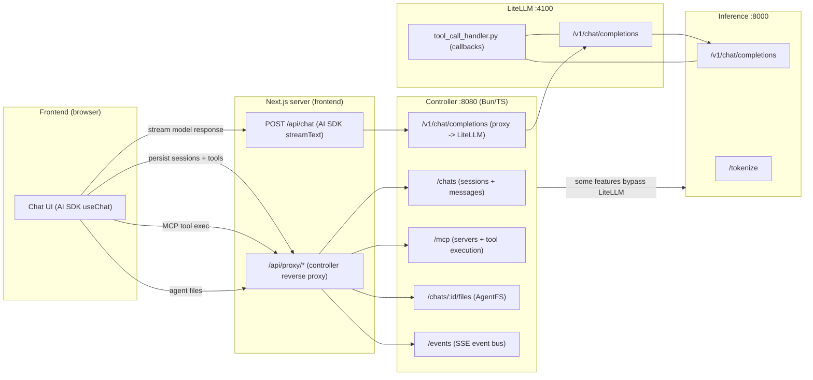
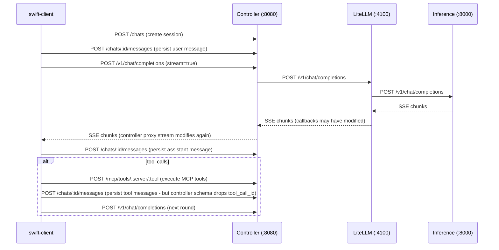

<!-- CRITICAL -->
# data.md - Data Flow, Types, and Transformations

This document maps:
- The end-to-end data flow across **controller**, **LiteLLM config**, **frontend (Next.js)**, and **swift-client (iOS)**.
- The **data types** we move around (messages, tool calls, sessions, streams, config).
- Every known **transformation point** (where we parse/normalize/mutate data).

Date: 2026-02-01

---

## 0) Glossary (repo-specific)

- Controller: Bun/TypeScript service in `controller/` (default `:8080`).
- Inference backend: OpenAI-compatible server (vLLM/SGLang/Tabby) on `:8000`.
- LiteLLM: API gateway on `:4100` (container port `4000`) configured by `config/litellm.yaml`.
- Frontend: Next.js app in `frontend/` (default `:3000`).
- Swift client: iOS app in `swift-client/`.
- MCP: Model Context Protocol tools (servers stored in controller DB; executed via stdio JSON-RPC).
- Agent loop (here): multi-step interaction where the model emits tool calls and the system executes tools and feeds results back until a final assistant message is produced.

---

## 1) End-to-end data flow (current)

There are effectively two separate planes:

1) **Inference plane** (chat completions, streaming, tool calls)
2) **Persistence + tooling plane** (sessions, messages DB, MCP servers/tools, AgentFS)

### 1.1 Current system: high-level flow

### 1.2 Current system: mobile flow (swift-client)

---

## 2) Primary data domains

### 2.1 Configuration data

| Layer | Storage | Examples | Read path(s) | Write path(s) |
|---|---|---|---|---|
| Controller runtime config | env + `.env` + persisted JSON | host/port, inference_port, data_dir, db_path, models_dir | `controller/src/config/env.ts` | `controller/src/routes/studio.ts` (persists `models_dir`) |
| LiteLLM routing/config | YAML + Python callback | `model_list`, timeouts, callback hooks | `config/litellm.yaml`, `config/tool_call_handler.py` | edit files + restart container |
| Frontend runtime settings | env + `data/api-settings.json` | backendUrl, inferenceUrl, apiKey | `frontend/src/lib/api-settings.ts` | `frontend/src/lib/api-settings.ts` |
| iOS settings | UserDefaults | backendUrl, apiKey, MCP enabled, plan mode | `swift-client/sources/core/services/settings-store.swift` | same (didSet save) |

### 2.2 Chat/session data

There are three distinct representations:

1) **AI SDK UIMessage** (web in-memory, streaming protocol)
2) **Controller persisted session/messages** (SQLite)
3) **Swift client StoredMessage/OpenAIMessage** (Codable models)

We currently do not have a single canonical schema enforced across all three.

### 2.3 Tooling data

| Type | Definition source | Execution plane | Result storage |
|---|---|---|---|
| MCP tools | Controller `/mcp/tools` (from MCP servers) | Controller executes via stdio JSON-RPC (`runMcpCommand`) | Web: stored inside assistant `tool_calls[].result` + `parts`; iOS: stored as separate `role=tool` messages but tool_call_id is not persisted by controller schema |
| Synthetic agent tools (plan) | Web client (`use-agent-tools.ts`), iOS (`PlanTools`) | Client-side only | Web: stored in `agent_state` (session), partially in message parts; iOS: stored in view model state + messages |
| AgentFS | Controller `AgentFS` per session | Controller | stored as separate sqlite file per session: `data/agentfs/<sessionId>.db` |

---

## 3) Core message types (as implemented)

### 3.1 Web in-memory: AI SDK `UIMessage`

Used by:
- `frontend/src/app/chat/_components/layout/chat-page.tsx` (source of truth in browser)

Shape (conceptual):
- `id: string`
- `role: "user" | "assistant" | ...`
- `parts: Array<...>` where parts can include:
  - `{ type: "text", text: string }`
  - tool parts: `type: "dynamic-tool"` or `type: "tool-<name>"` with `toolCallId`, `input`, and later `output`/`errorText`
- `metadata: unknown` (used to store `model` and `usage` at stream boundaries)

Key transformation:
- Web -> model messages: `convertToModelMessages(messages)` in `frontend/src/app/api/chat/route.ts`.

### 3.2 Web persisted: controller `chat_messages` row

Stored in SQLite at:
- `data/chats.db` (note: separate from `data/controller.db`)

Schema (from `controller/src/stores/chat-store.ts`):
- `chat_sessions(id, title, model, parent_id, agent_state, created_at, updated_at)`
- `chat_messages(id, session_id, role, content, model, tool_calls, parts, metadata, request_*_tokens, created_at)`

Important: controller schema does NOT store:
- `tool_call_id` (to link tool results to a tool call)
- `name` (OpenAI tool message `name`)
- a first-class tool result table (it currently piggybacks on `tool_calls[].result` or separate messages without linkage)

### 3.3 iOS in-memory + persisted-to-controller: `StoredMessage` / `OpenAIMessage`

Defined in:
- `swift-client/sources/core/models/chat/chat-message.swift`
- `swift-client/sources/core/models/chat/chat-completion-models.swift`

Key shapes:

`StoredMessage` (what iOS sends to controller `/chats/:id/messages`):
- `id, role, content, model`
- `toolCalls?: [ToolCall]`
- `toolCallId?: String` (encoded to JSON `tool_call_id`)
- token fields

`OpenAIMessage` (what iOS sends to `/v1/chat/completions`):
- `role, content`
- `toolCalls?: [ToolCall]`
- `toolCallId?: String` (for tool role messages)

Mismatch:
- iOS emits `role="tool"` messages referencing `tool_call_id`.
- Controller accepts `role` but DROPS `tool_call_id` because it is not stored and not even read in `controller/src/routes/chats.ts`.

---

## 4) Inference wire protocol types (OpenAI-compatible)

### 4.1 Chat completions request (as sent today)

Where built:
- Web: `frontend/src/app/api/chat/route.ts` (AI SDK builds OpenAI-compatible request)
- iOS: `swift-client/.../OpenAIChatService.buildRequest()` (manual request)
- Controller features: compaction/tokenization/title use direct fetch to `:8000` or `:4100`

Typical request fields in this repo:
- `model: string`
- `messages: Array<{role, content, tool_calls?, tool_call_id?, name?}>`
- `tools: Array<{type:"function", function:{name, description, parameters}}>`
- `tool_choice?: "auto" | ...` (web sends indirectly)
- `stream: boolean`
- `stream_options: { include_usage: true }` (iOS uses `streamOptions.includeUsage`)

### 4.2 Streaming response chunks (SSE)

Where parsed/modified:
- LiteLLM callback: `config/tool_call_handler.py` (limited streaming support; buffers)
- Controller stream transformer: `controller/src/services/proxy-streamer.ts`
- iOS stream parser: `swift-client/sources/core/services/openai-chat-service.swift` + `SseParser`
- Web stream parser: AI SDK (`useChat`)

Minimal chunk structure expected (OpenAI-style):
- `data: {"id":"...","choices":[{"delta":{"content":"...","tool_calls":[...]}, "finish_reason":null}], "usage":{...}}`
- end marker: `data: [DONE]`

Repo-specific variations we try to normalize:
- `delta.reasoning` vs `delta.reasoning_content`
- `<think>...</think>` embedded in `delta.content`
- tool calls embedded as:
  - `<tool_call>{...}</tool_call>` (Hermes-like)
  - `<use_mcp_tool>...</use_mcp_tool>` (MCP XML)
  - raw JSON snippets in plain text
  - malformed tool_calls entries with missing function names

---

## 5) Transformation points (what changes data, where, and how)

This is the heart of the debugging problem: the same conceptual data is rewritten in multiple places.

### 5.1 LiteLLM callback transformation (config/tool_call_handler.py)

Files:
- `config/litellm.yaml` (registers callback)
- `config/tool_call_handler.py`

Transformations:
- PRE-CALL:
  - Converts deprecated `functions`/`function_call` -> `tools`/`tool_choice`.
  - For MCP-style models (e.g., MiroThinker):
    - Converts OpenAI `tools[]` into a system prompt describing tools in MCP XML format.
    - Converts OpenAI tool-call history back into MCP-style content so the model "sees" tool history in its native format.
- POST-CALL (non-streaming):
  - Extracts `<think>...</think>` into `reasoning_content`.
  - Parses tool calls from content when native `tool_calls` are missing or malformed.
  - For MCP XML tool calls, maps `{server_name, tool_name}` -> OpenAI function name `server__tool`.
  - Strips tool XML/JSON from `message.content` after extracting tool calls.

Impact:
- This mutates responses before the controller proxy sees them.

### 5.2 Controller `/v1/chat/completions` proxy transformation

File:
- `controller/src/routes/proxy.ts`

Transformations:
- Pre-request:
  - Rewrites requested `model` to a canonical recipe model name (served_model_name or recipe id).
  - Injects a UTF-8 avoidance system prompt for GLM-family models (tokenizer streaming issues).
  - Ensures the requested recipe is running; may evict/launch model process.
- Post-response (non-streaming):
  - If `tool_calls` are missing but tool-call patterns exist in message content, parses tool calls from content and sets `finish_reason="tool_calls"`.
  - Tracks token usage into lifetime metrics store.
- Post-response (streaming):
  - Wraps upstream SSE stream with `createProxyStream()` to normalize and patch chunks.

### 5.3 Controller stream rewriter: `createProxyStream()`

File:
- `controller/src/services/proxy-streamer.ts`

Chunk-level transformations:
- Strip empty `role=user` echoes emitted by some providers (`stripUserEchoLines()`).
- Remove redundant `delta.reasoning` when both `reasoning` and `reasoning_content` appear.
- Convert `<think>` tags embedded in content into `reasoning_content` (`parseThinkTagsFromContent()`).
- Fix malformed tool_calls where function names are empty (`fixMalformedToolCalls()`).
- Attempt to parse tool calls from raw content (fallback) at end-of-stream (`parseToolCallsFromContent()`).
- Clean UTF-8 corruption artifacts (replacement chars) for known tokenizer issues (`cleanUtf8StreamContent()`).
- Track `usage` when it appears in-stream; report via callback to store lifetime metrics.

Mismatch to MCP naming:
- `parseToolCallsFromContent()` (TS) currently parses `<use_mcp_tool>` but only uses `<tool_name>` as function name (drops `<server_name>`), unlike the LiteLLM callback which uses `server__tool`.

### 5.4 Web server inference route: `/api/chat`

File:
- `frontend/src/app/api/chat/route.ts`

Transformations:
- Takes `UIMessage[]` from client and converts to AI SDK model messages via `convertToModelMessages()`.
- Converts UI tool definitions -> AI SDK `tools` using `jsonSchema()`.
- Uses `stopWhen: stepCountIs(1)` (forces one model step per HTTP request).
- Streams back AI SDK UIMessage protocol (`toUIMessageStreamResponse`) with:
  - `sendReasoning: true`
  - `messageMetadata` includes model + usage

### 5.5 Web client tool loop + persistence

Files:
- `frontend/src/app/chat/_components/layout/chat-page.tsx` (agent loop orchestration)
- `frontend/src/app/chat/hooks/use-chat-transport.ts` (persistence mapping)
- `frontend/src/app/chat/hooks/use-chat-tools.ts` (MCP tools)

Transformations:
- Tool args normalization: `normalizeToolArgs()` tries to reconcile AI SDK versions (`toolCall.input` vs `args` vs `arguments`).
- Tool execution:
  - MCP: call controller `/mcp/tools/:server/:tool` and store result in `toolResultsMap`.
  - Agent plan tools: executed locally; output injected via `addToolOutput`.
- Message persistence:
  - `persistMessage()` maps UIMessage parts into a stored message:
    - `content` = concatenated text parts
    - `tool_calls` = extracted from tool parts, including `function.arguments` and `result`
    - stores raw `parts` + `metadata` to preserve full trace
  - A follow-up effect re-persists assistant messages after `addToolOutput()` mutates tool parts (because AI SDK mutates message after `onFinish`).

### 5.6 iOS tool loop + persistence

Files:
- `swift-client/sources/features/chat/chat-detail-stream.swift` (loop)
- `swift-client/sources/core/services/openai-chat-service.swift` (stream parsing)
- `swift-client/sources/features/chat/mcp-tool-runner.swift` (MCP exec)

Transformations:
- Builds tool defs from MCP tool list + PlanTools.
- Streams OpenAI chat completion via SSE and manually assembles:
  - content
  - reasoning (from `reasoning_content` or by parsing `<think>` blocks)
  - tool calls (buffered by tool call index; arguments appended)
- Executes tool calls in-loop:
  - Plan tools locally
  - MCP via controller endpoint
- Persists assistant + tool messages to controller via `/chats/:id/messages`

Critical mismatch:
- iOS persists tool results as separate `role=tool` messages containing `tool_call_id`.
- Controller currently does not store `tool_call_id`, so tool-result linkage is lost on reload/compaction.

---

## 6) Data mutation map (why debugging is hard)

### 6.1 The same conceptual fields are normalized multiple times

| Concept | Where it SHOULD be normalized | Where it IS normalized today | Result |
|---|---|---|---|
| Tool calls | single parser (canonical) | `config/tool_call_handler.py`, `controller/src/services/proxy-parsers.ts`, web client arg parsing, iOS stream parser | duplicated behavior; inconsistent names (`server__tool` vs `tool`) |
| Reasoning (`<think>`) | single normalization stage | LiteLLM callback, controller proxy streamer, web client thinking stripper, iOS thinking parser | reasoning leaks or is double-stripped |
| Tool results | single trace schema | web stores in `tool_calls[].result` + parts; iOS stores as separate tool messages | parity broken; linkage missing in DB |
| Token usage | single measurement method | controller lifetime metrics (proxy), iOS tokenization endpoint + streaming usage, web metadata usage | inconsistent accounting; hard to trust |

### 6.2 Data is stored in multiple formats across clients

| Layer | Tool results representation | Pros | Cons |
|---|---|---|---|
| Web (AI SDK) | tool output stored as mutated tool parts and persisted into `tool_calls[].result` | single assistant message captures full trace | requires careful post-mutation persistence; depends on AI SDK internal protocol |
| iOS | separate tool messages (`role=tool`) | matches OpenAI prompt format | controller DB schema does not persist tool_call_id/name, so trace is unreconstructable |

---

## 7) Minimum invariants we should enforce (ideal contracts)

These invariants are the baseline for making multi-turn tool calling debuggable and consistent:

1) Every tool call has a stable `tool_call_id` (string) and a canonical `tool_name` (string).
2) Every tool result references its `tool_call_id` (never inferred from ordering).
3) The persistence layer stores:
   - assistant tool call inputs
   - tool execution result (content + isError)
   - timing (start/end)
   - tool identity (server, tool name)
4) Tool call parsing occurs in exactly one place (a "parser factory") with test vectors.
5) Reasoning normalization occurs in exactly one place (or is explicitly preserved as a separate channel end-to-end).
6) Clients do not need to parse tool calls out of free-form text in order to function.

---

## 8) References (standards to align with)

- AI SDK docs (tools, streaming, message formats): https://ai-sdk.dev/docs/introduction
- OpenAI API (chat completions, streaming SSE, tool calling): https://platform.openai.com/docs/api-reference/chat
- Model Context Protocol: https://modelcontextprotocol.io/
- LiteLLM docs (proxy/callbacks): https://docs.litellm.ai/

