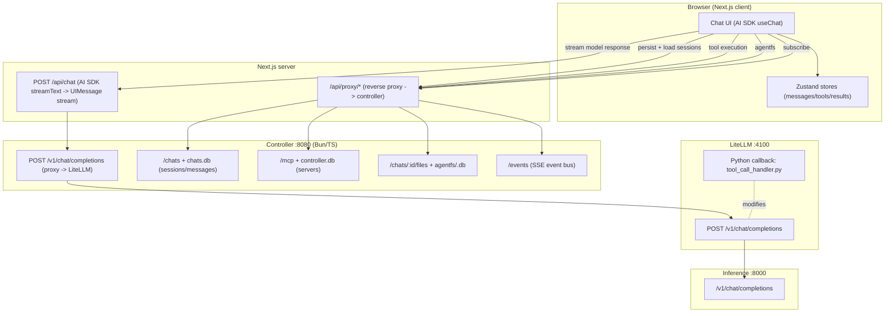
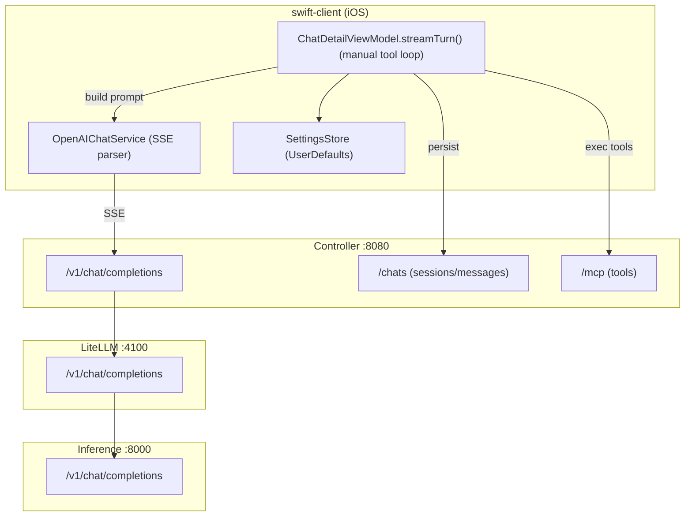
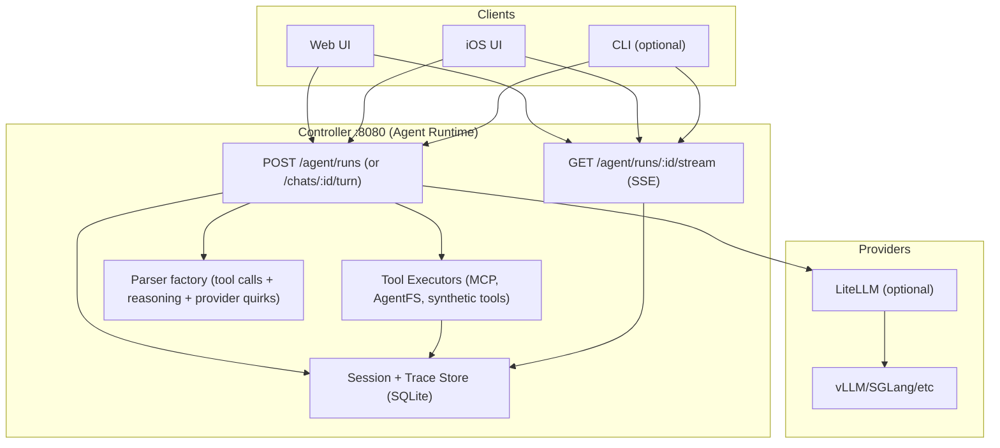
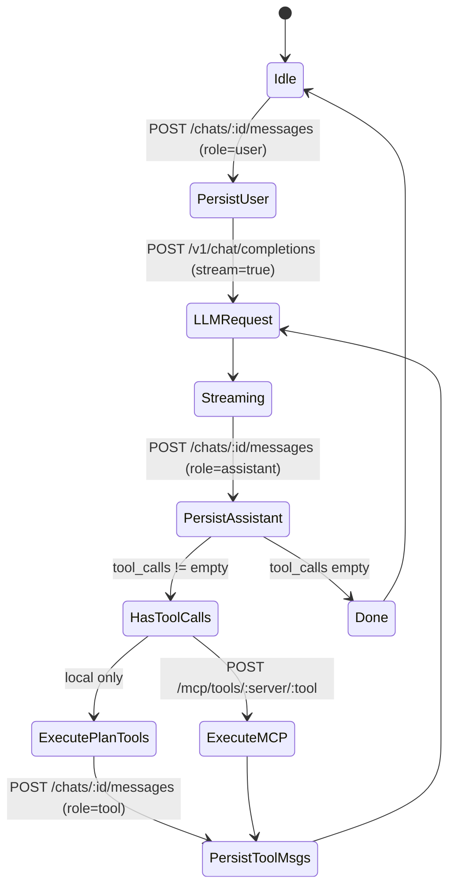
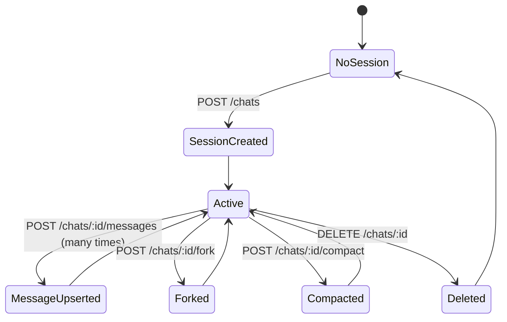
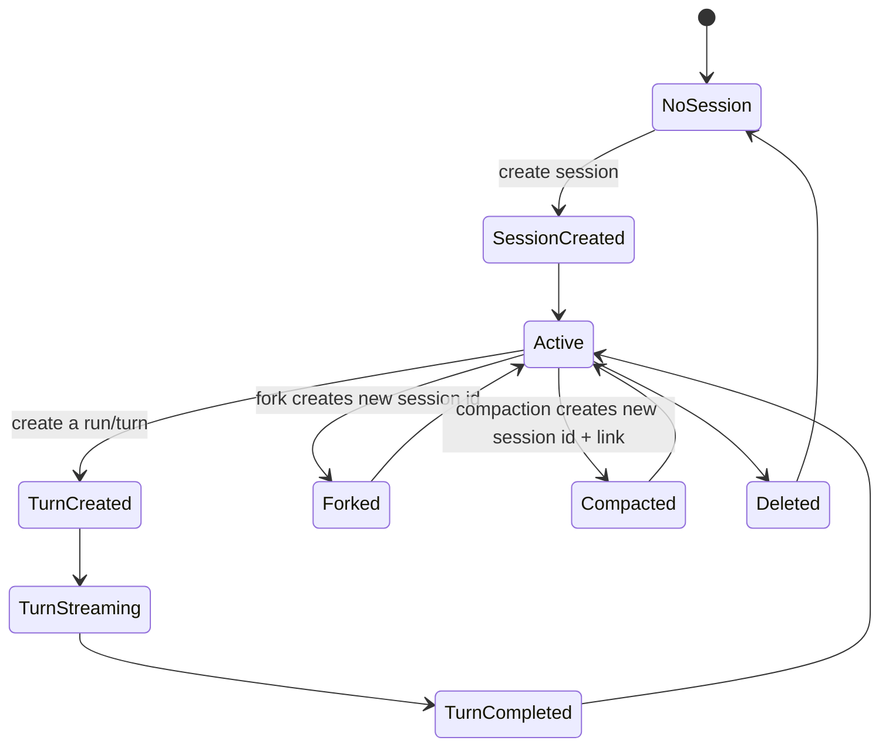
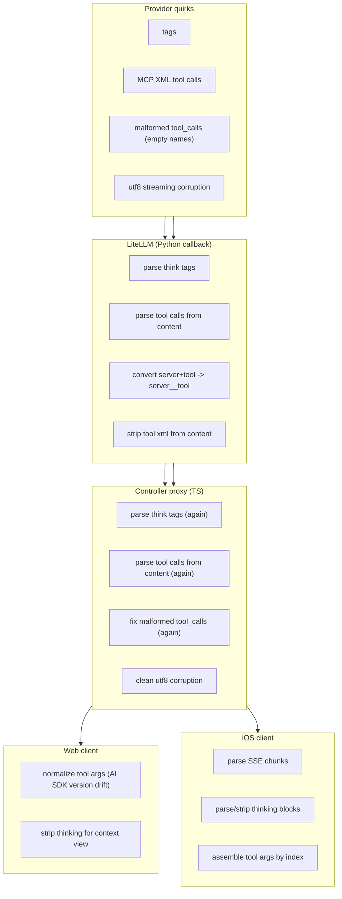
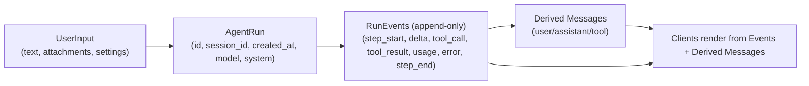

<!-- CRITICAL -->
# state-diagram-machine.md - Current vs Ideal Diagrams (Visibility Pack)

This file is a "diagram bank" for the system: architecture, state machines, sequence diagrams, and diff views.

Goal: make the current agent loop and session system visually inspectable, and make the target (ideal) design unambiguous.

Date: 2026-02-01

---

## 0) Diagram index

- A1. Current architecture (web + controller + litellm + inference)
- A2. Current architecture (iOS + controller)
- A3. Ideal architecture (single agent runtime)
- S1. Current web agent loop (AI SDK tool loop)
- S2. Current iOS agent loop (manual loop)
- S3. Ideal agent loop (server-owned, event-sourced)
- S4. Session lifecycle (current)
- S5. Session lifecycle (ideal)
- D1. Parsing/normalization locations (current)
- D2. Data contracts (ideal)
- Q1. "Where did my data change?" checklist map

---

## A1) Current architecture (web)



Notes:
- Web inference streaming is "front-end owned": tool calls emitted to browser; browser executes tools; browser resends.
- Persistence is done out-of-band via controller (`/chats/...`), not by the inference route.

---

## A2) Current architecture (iOS)



Notes:
- iOS calls controller directly for both inference and persistence.
- iOS stores tool results as separate tool messages; controller schema currently loses tool_call_id linkage.

---

## A3) Ideal architecture (single agent runtime, shared contract)

Principle: **the controller owns the agent loop**. Clients become thin renderers + input providers.



Key changes vs current:
- One canonical stream protocol for agent runs (SSE of typed events).
- One canonical persistence schema for tool calls/results and model steps.
- "Parser factory" lives in one place, versioned and tested.

---

## S1) Current web agent loop (AI SDK tool loop, client-owned)

```mermaid
stateDiagram-v2
  [*] --> Idle

  Idle --> UserSubmitted: user clicks Send
  UserSubmitted --> Streaming: POST /api/chat

  Streaming --> ToolCallEmitted: model emits tool call part
  ToolCallEmitted --> ToolExecuting: browser executes MCP / local tool
  ToolExecuting --> ToolOutputInjected: addToolOutput(toolCallId,...)

  ToolOutputInjected --> AutoResubmit: sendAutomaticallyWhen(...)
  AutoResubmit --> Streaming: POST /api/chat (next step)

  Streaming --> Completed: stream finish (no tool calls)
  Completed --> Idle

  note right of ToolOutputInjected
    Persistence is tricky: AI SDK mutates\nassistant message after onFinish.\nFollow-up persistence required.
```

Observed pain points:
- Two sources of truth: in-memory UIMessage vs controller stored messages.
- Tool results persistence is delayed and can be missed (race/edge cases).

---

## S2) Current iOS agent loop (manual loop, client-owned)



Observed pain points:
- Tool messages depend on `tool_call_id`, but controller schema drops it.
- The same parsing rules (reasoning/tool calls) are reimplemented in Swift and TS and LiteLLM.

---

## S3) Ideal agent loop (server-owned, event-sourced)

We want a single loop for all clients.

```mermaid
stateDiagram-v2
  [*] --> Ready

  Ready --> TurnStarted: POST /chats/:id/turn
  TurnStarted --> PersistedInput: store user message + attachments + settings
  PersistedInput --> LLMStreaming: start model stream

  LLMStreaming --> ToolCallsDetected: tool call event(s)
  ToolCallsDetected --> ToolExec: run tools (MCP/AgentFS/local)
  ToolExec --> PersistToolResults: store tool results with tool_call_id
  PersistToolResults --> LLMStreaming: next model step

  LLMStreaming --> PersistedAssistant: assistant message complete
  PersistedAssistant --> Ready

  note right of LLMStreaming
    Controller emits typed SSE events:\n- token deltas\n- reasoning deltas\n- tool_call\n- tool_result\n- step_start/step_end\n- usage\n- errors
```

This design makes:
- persistence deterministic
- replay/debug possible (event log)
- client logic minimal

---

## S4) Session lifecycle (current)



Weakness:
- "Message" is overloaded: can represent UI text, tool calls, tool results, metadata, partial traces.
- Tool traces are not first-class and differ by client.

---

## S5) Session lifecycle (ideal)

Introduce explicit "runs" / "turns" and keep a stable session id.



In ideal, a session is:
- stable id
- a sequence of turns/runs
- each run has an event log (tool calls/results included)

---

## D1) Parsing/normalization locations (current)



Takeaway:
- We have no single source of truth for normalization.
- Fixes are scattered and partially redundant.

---

## D2) Data contracts (ideal)

Define a small number of canonical artifacts:



Rule:
- "Messages" are a projection. The event log is the source of truth.

---

## Q1) "Where did my data change?" checklist map

When debugging a bad interaction, check in this order:

1) Provider output: did the model actually emit `tool_calls`, or did it emit tool XML in `content`?
2) LiteLLM callback: did it convert MCP tool calls -> `server__tool`? Did it strip XML? Did it touch `<think>`?
3) Controller proxy: did `createProxyStream()` rewrite `reasoning`/`tool_calls` or inject prompts?
4) Client parser:
   - Web: AI SDK parts and `onToolCall` args normalization
   - iOS: SSE decoding and tool buffer assembly
5) Persistence: what exactly got written to `data/chats.db`:
   - does the assistant message have `tool_calls[]`?
   - do we have the tool results trace (and is it linked)?

