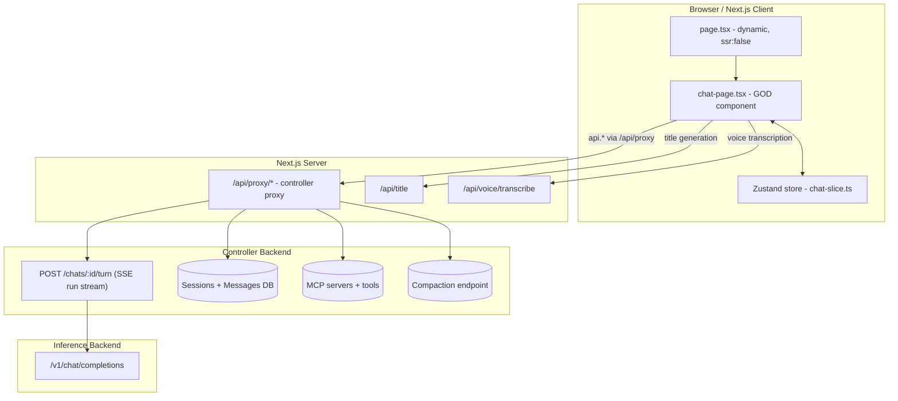

## 1) High-level architecture (3 “planes”)

### 1.1 Runtime system diagram

### 1.2 Single controller-owned chat backend (important)

There is now **one** network path for chat:

1) **Controller run stream**
- Client sends messages to `POST /chats/:sessionId/turn` (via `/api/proxy`).
- Controller persists messages, runs the agent loop, executes tools, and streams SSE events.

2) **Inference backend**
- Only the controller talks to `/v1` during the run.

This removes the previous split between streaming and persistence. Tool execution is server-side.

