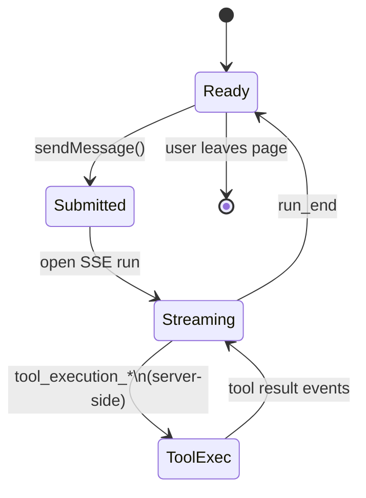
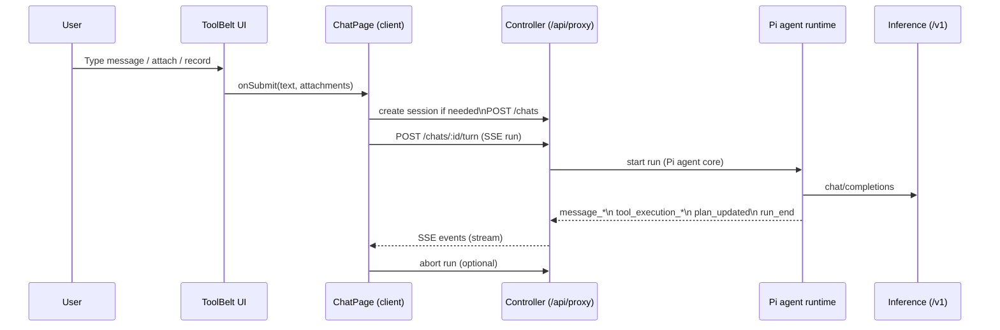
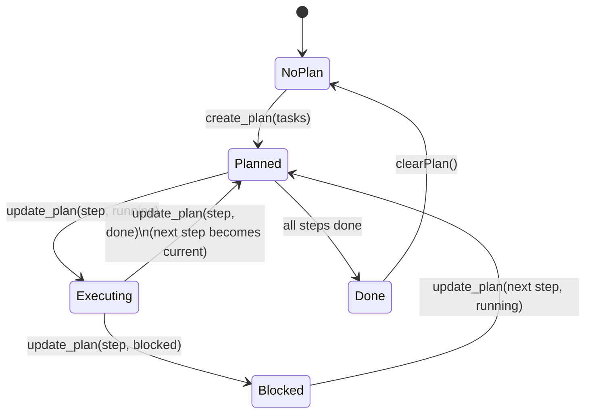
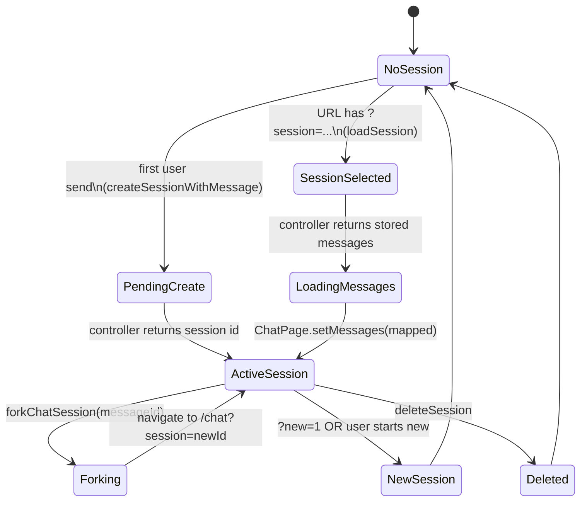
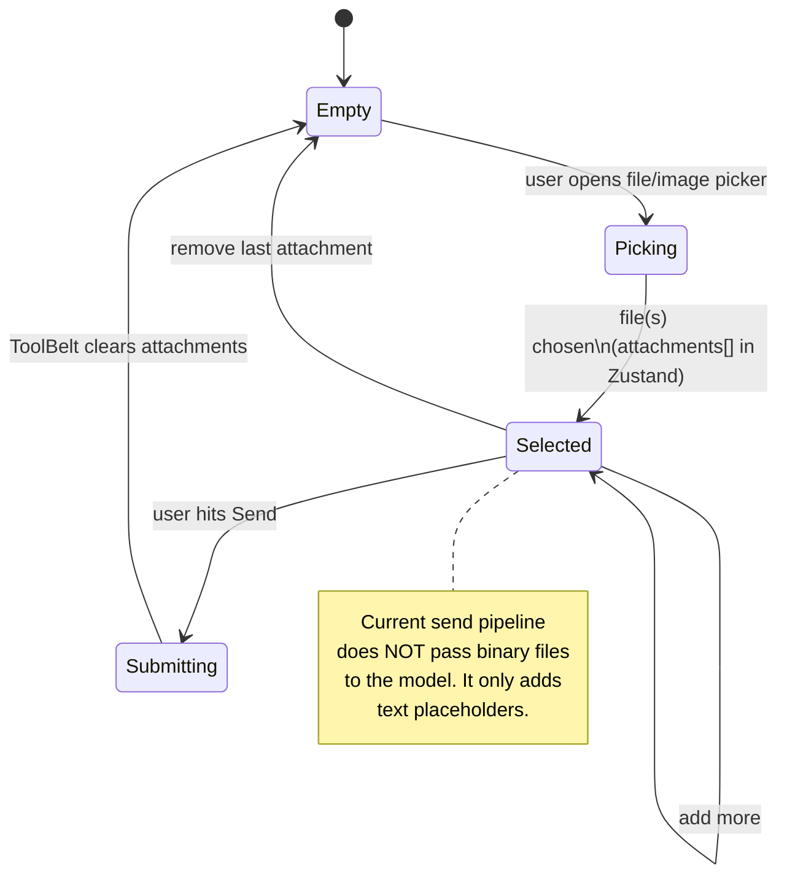
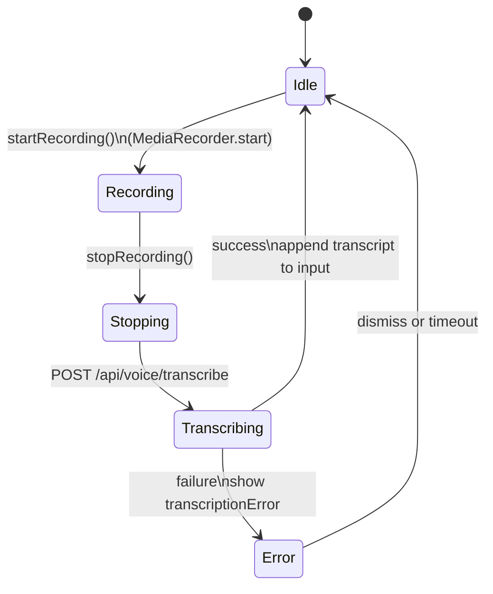
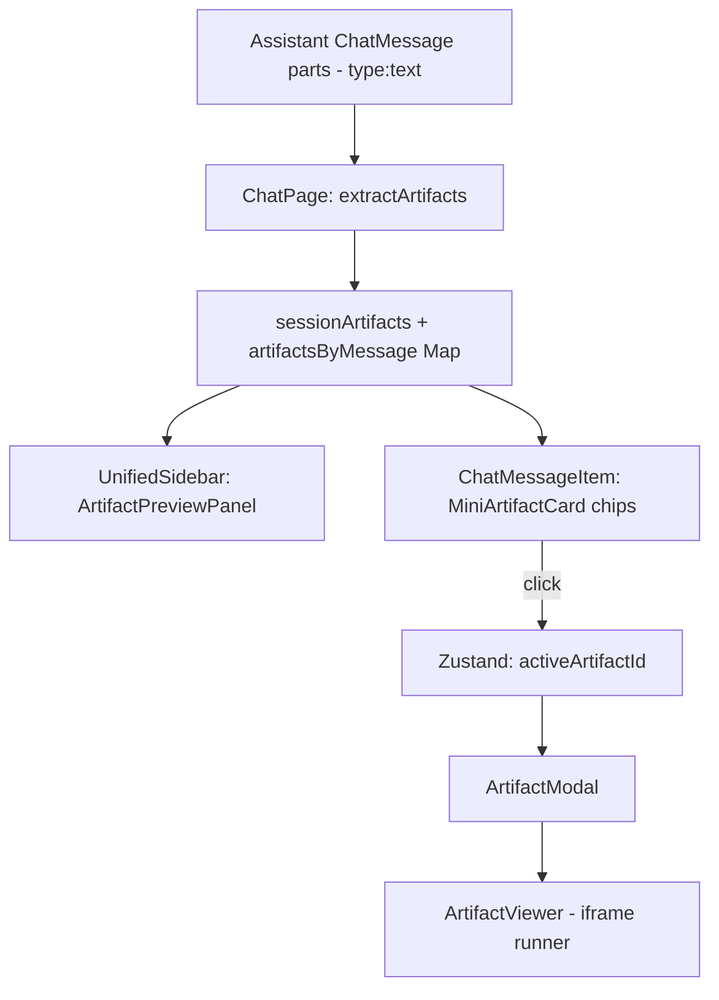
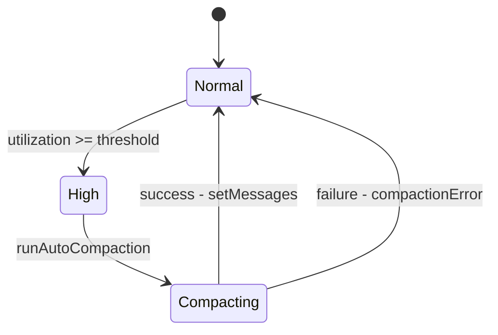
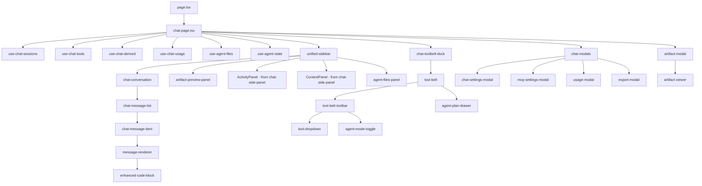

<!-- CRITICAL -->
## 2) Core runtime loops (state machines)

### 2.1 Chat streaming + tool loop (controller-run)

Notes:
- Tool calls are executed **on the controller** by the Pi agent runtime.
- The client only renders `message_*`, `tool_execution_*`, and `plan_updated` events from the run stream.

### 2.2 End-to-end sequence diagram (user message)

### 2.3 Agent Plan state machine

Where it lives:
- Tool definitions + execution: controller `services/agent-runtime/tool-registry.ts` (out of scope).
- UI: `src/app/chat/_components/agent/agent-plan-drawer.tsx` + `chat-page.tsx` event handling.

### 2.4 Session lifecycle state machine

### 2.5 Attachments lifecycle (UI)

### 2.6 Voice recording + transcription lifecycle

### 2.7 Artifact lifecycle (extraction → preview → modal)

### 2.8 Context compaction lifecycle (auto)

### 2.9 Intra-chat component graph (in-scope)

