# System Maps and Repository Topology

This document maps the vLLM Studio codebase, state machines, and external integrations.

## Repository Overview

- `controller/`: FastAPI controller, model lifecycle orchestration, SSE events, SQLite storage.
- `frontend/`: Next.js UI, API proxy routes, chat UX, voice input, and settings UI.
- `config/`: LiteLLM routing, Prometheus/Grafana provisioning, tool call handler.
- `data/`: Runtime persistence (SQLite DBs, settings JSON, and optional Docker volumes).
- `docker-compose.yml`: Optional infra stack (LiteLLM, Postgres, Redis, Prometheus, Grafana, frontend).

## External Systems and Data Stores

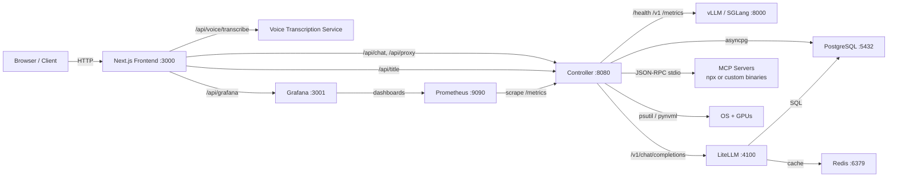
```mermaid
flowchart LR
    Browser[Browser / Client] -->|HTTP| Frontend[Next.js Frontend :3000]
    Frontend -->|/api/chat, /api/proxy| Controller[Controller :8080]
    Frontend -->|/api/voice/transcribe| VoiceService[Voice Transcription Service]
    Frontend -->|/api/grafana| Grafana[Grafana :3001]
    Frontend -->|/api/title| Controller

    Controller -->|/health /v1 /metrics| Inference[vLLM / SGLang :8000]
    Controller -->|/v1/chat/completions| LiteLLM[LiteLLM :4100]
    Controller -->|asyncpg| Postgres[PostgreSQL :5432]
    Controller -->|JSON-RPC stdio| MCP["MCP Servers<br/>npx or custom binaries"]
    Controller -->|psutil / pynvml| Host[OS + GPUs]

    LiteLLM -->|SQL| Postgres
    LiteLLM -->|cache| Redis[Redis :6379]
    Prometheus[Prometheus :9090] -->|scrape /metrics| Controller
    Grafana -->|dashboards| Prometheus
```

**Persistence surfaces**
- `data/controller.db`: Recipes, MCP servers, peak/lifetime metrics.
- `data/chats.db`: Chat sessions + messages.
- `frontend/data/api-settings.json`: UI-configurable API settings.
- `/tmp/vllm_*.log`: Inference logs (by recipe id).
- `data/postgres`, `data/redis`, `data/prometheus`, `data/grafana`: Docker volumes (optional).

## Module Dependency Graphs

### Controller Module Graph

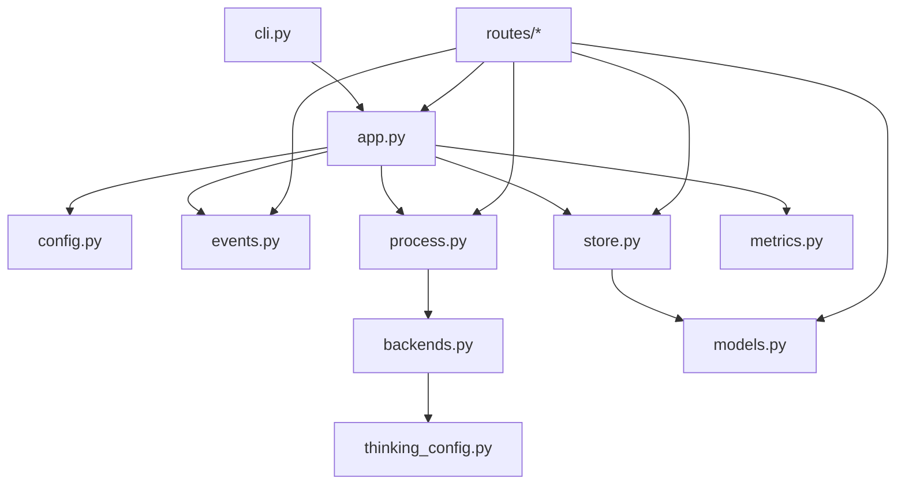
```mermaid
graph TD
    cli[cli.py] --> app[app.py]
    app --> config[config.py]
    app --> events[events.py]
    app --> store[store.py]
    app --> process[process.py]
    app --> metrics[metrics.py]
    process --> backends[backends.py]
    backends --> thinking[thinking_config.py]
    store --> models[models.py]
    routes[routes/*] --> app
    routes --> store
    routes --> process
    routes --> events
    routes --> models
```

### Frontend Module Graph

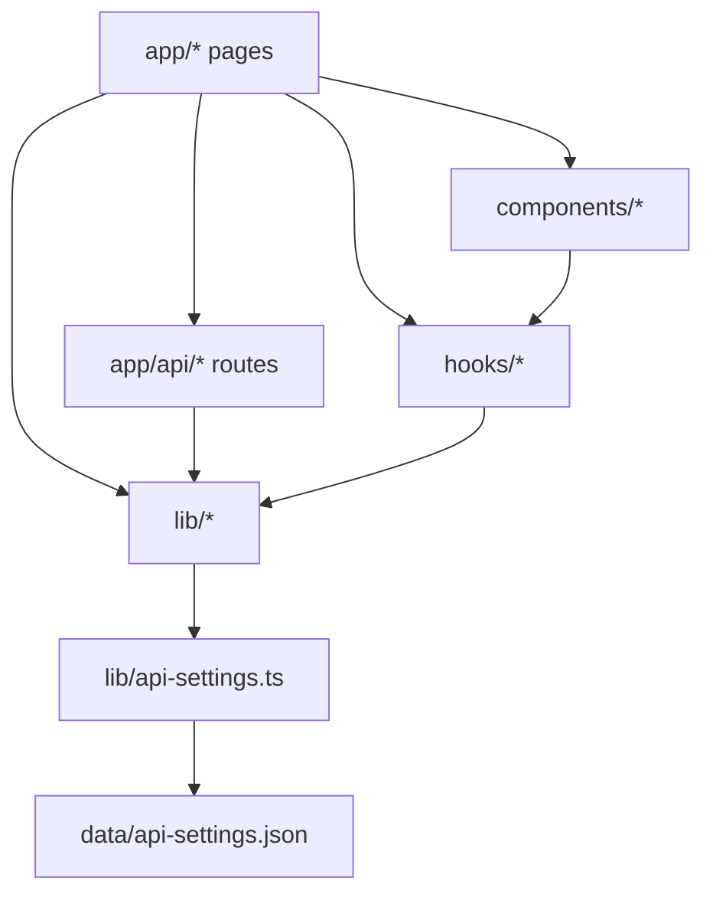
```mermaid
graph TD
    app[app/* pages] --> components[components/*]
    app --> hooks[hooks/*]
    app --> lib[lib/*]
    api[app/api/* routes] --> lib
    components --> hooks
    hooks --> lib
    lib --> api_settings[lib/api-settings.ts]
    api_settings --> data[data/api-settings.json]
    app --> api
```

## Controller State Maps

### App Lifespan + Metrics Loop (`controller/app.py`)

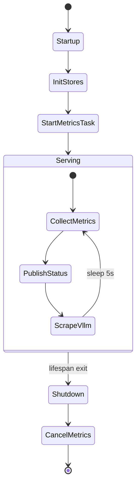
```mermaid
stateDiagram-v2
    [*] --> Startup
    Startup --> InitStores
    InitStores --> StartMetricsTask
    StartMetricsTask --> Serving

    state Serving {
        [*] --> CollectMetrics
        CollectMetrics --> PublishStatus
        PublishStatus --> ScrapeVllm
        ScrapeVllm --> CollectMetrics: sleep 5s
    }

    Serving --> Shutdown: lifespan exit
    Shutdown --> CancelMetrics
    CancelMetrics --> [*]
```

### Model Launch + Preemption (`controller/routes/lifecycle.py`)

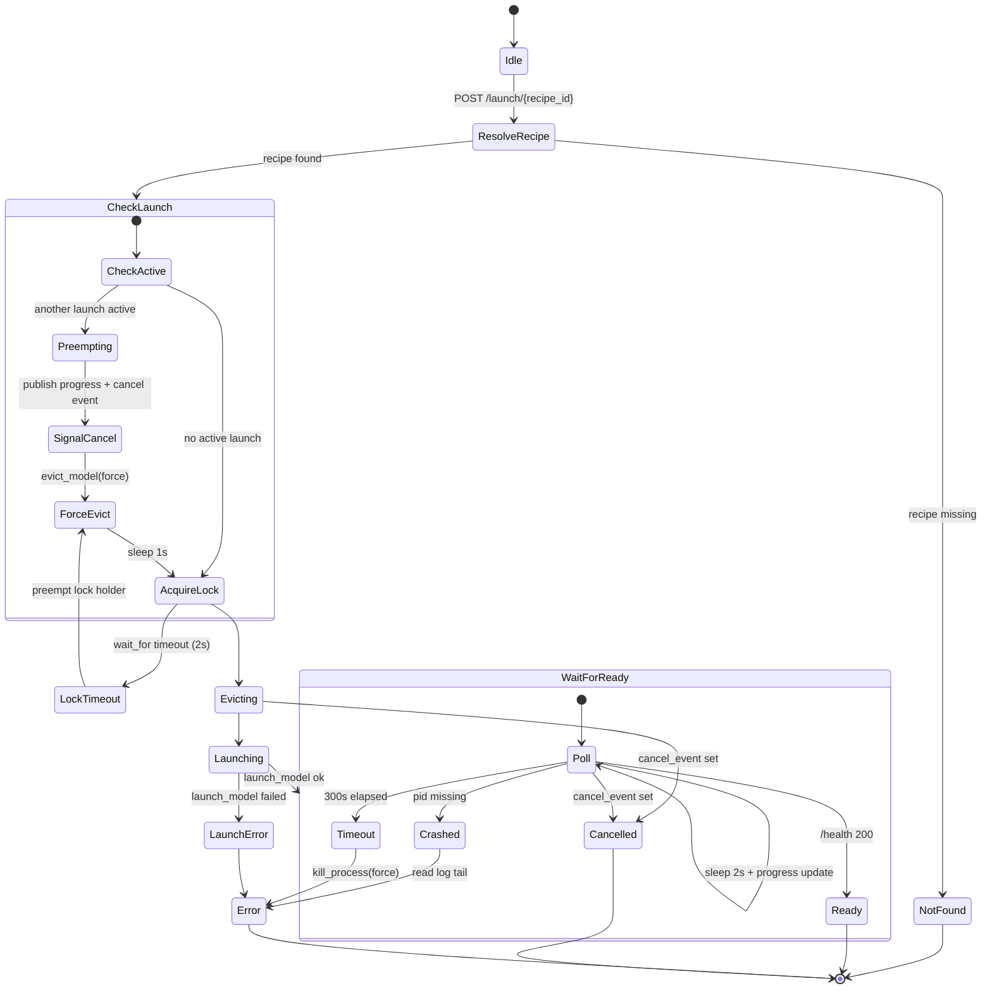
```mermaid
stateDiagram-v2
    [*] --> Idle
    Idle --> ResolveRecipe: POST /launch/{recipe_id}
    ResolveRecipe --> NotFound: recipe missing
    ResolveRecipe --> CheckLaunch: recipe found
    NotFound --> [*]

    state CheckLaunch {
        [*] --> CheckActive
        CheckActive --> Preempting: another launch active
        CheckActive --> AcquireLock: no active launch
        Preempting --> SignalCancel: publish progress + cancel event
        SignalCancel --> ForceEvict: evict_model(force)
        ForceEvict --> AcquireLock: sleep 1s
    }

    AcquireLock --> LockTimeout: wait_for timeout (2s)
    LockTimeout --> ForceEvict: preempt lock holder
    AcquireLock --> Evicting

    Evicting --> Cancelled: cancel_event set
    Evicting --> Launching

    Launching --> LaunchError: launch_model failed
    Launching --> WaitForReady: launch_model ok

    state WaitForReady {
        [*] --> Poll
        Poll --> Poll: sleep 2s + progress update
        Poll --> Ready: /health 200
        Poll --> Crashed: pid missing
        Poll --> Timeout: 300s elapsed
        Poll --> Cancelled: cancel_event set
    }

    Crashed --> Error: read log tail
    Timeout --> Error: kill_process(force)
    LaunchError --> Error

    Ready --> [*]
    Error --> [*]
    Cancelled --> [*]
```

### Process Eviction + Termination (`controller/process.py`)

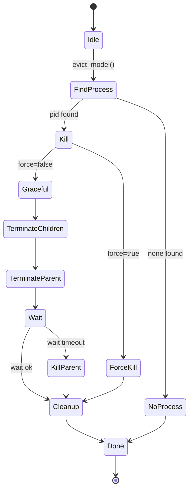
```mermaid
stateDiagram-v2
    [*] --> Idle
    Idle --> FindProcess: evict_model()
    FindProcess --> NoProcess: none found
    FindProcess --> Kill: pid found

    Kill --> ForceKill: force=true
    Kill --> Graceful: force=false

    Graceful --> TerminateChildren
    TerminateChildren --> TerminateParent
    TerminateParent --> Wait
    Wait --> KillParent: wait timeout
    Wait --> Cleanup: wait ok
    KillParent --> Cleanup

    ForceKill --> Cleanup
    Cleanup --> Done

    NoProcess --> Done
    Done --> [*]
```

### Auto-Switch Proxy Flow (`controller/routes/proxy.py`)

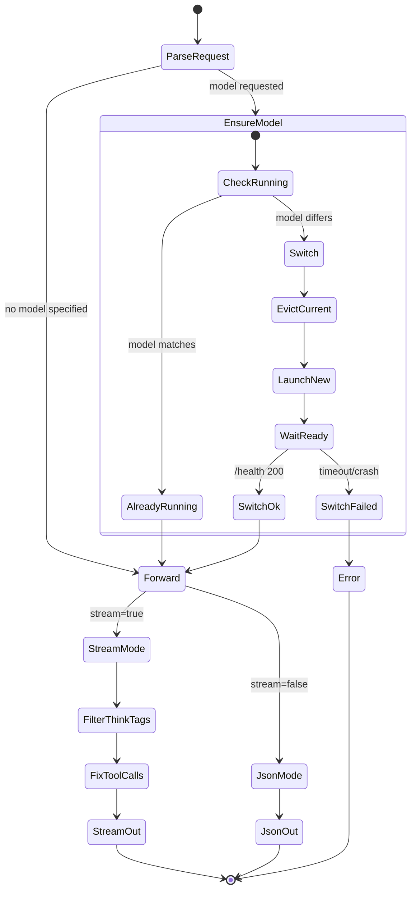
```mermaid
stateDiagram-v2
    [*] --> ParseRequest
    ParseRequest --> EnsureModel: model requested
    ParseRequest --> Forward: no model specified

    state EnsureModel {
        [*] --> CheckRunning
        CheckRunning --> AlreadyRunning: model matches
        CheckRunning --> Switch: model differs
        Switch --> EvictCurrent
        EvictCurrent --> LaunchNew
        LaunchNew --> WaitReady
        WaitReady --> SwitchFailed: timeout/crash
        WaitReady --> SwitchOk: /health 200
    }

    AlreadyRunning --> Forward
    SwitchOk --> Forward
    SwitchFailed --> Error

    Forward --> StreamMode: stream=true
    Forward --> JsonMode: stream=false

    StreamMode --> FilterThinkTags
    FilterThinkTags --> FixToolCalls
    FixToolCalls --> StreamOut

    JsonMode --> JsonOut
    StreamOut --> [*]
    JsonOut --> [*]
    Error --> [*]
```

### Chat Sessions + Messages (`controller/routes/chats.py`, `controller/store.py`)

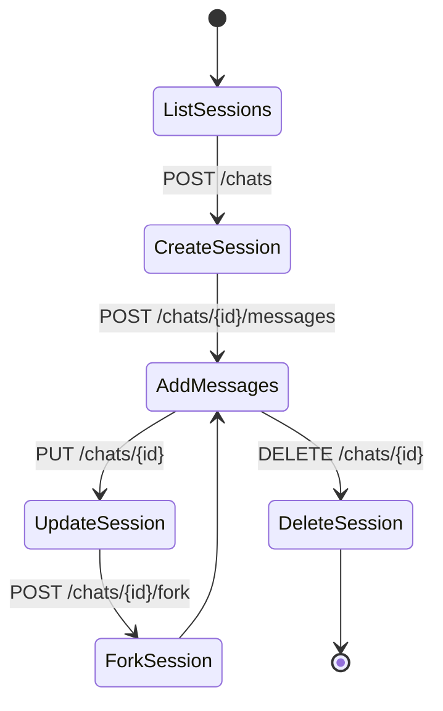
```mermaid
stateDiagram-v2
    [*] --> ListSessions
    ListSessions --> CreateSession: POST /chats
    CreateSession --> AddMessages: POST /chats/{id}/messages
    AddMessages --> UpdateSession: PUT /chats/{id}
    UpdateSession --> ForkSession: POST /chats/{id}/fork
    ForkSession --> AddMessages
    AddMessages --> DeleteSession: DELETE /chats/{id}
    DeleteSession --> [*]
```

### MCP Tool Execution (`controller/routes/mcp.py`)

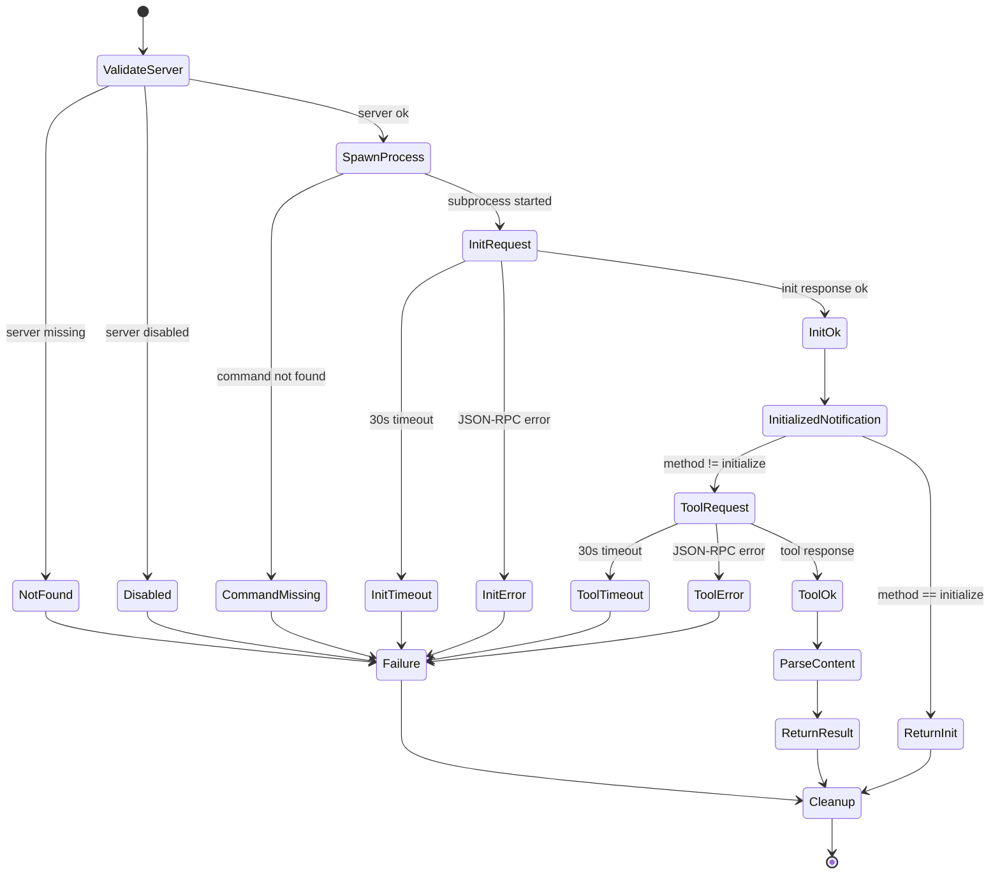
```mermaid
stateDiagram-v2
    [*] --> ValidateServer
    ValidateServer --> NotFound: server missing
    ValidateServer --> Disabled: server disabled
    ValidateServer --> SpawnProcess: server ok

    SpawnProcess --> CommandMissing: command not found
    SpawnProcess --> InitRequest: subprocess started

    InitRequest --> InitTimeout: 30s timeout
    InitRequest --> InitError: JSON-RPC error
    InitRequest --> InitOk: init response ok

    InitOk --> InitializedNotification
    InitializedNotification --> ToolRequest: method != initialize
    InitializedNotification --> ReturnInit: method == initialize

    ToolRequest --> ToolTimeout: 30s timeout
    ToolRequest --> ToolError: JSON-RPC error
    ToolRequest --> ToolOk: tool response

    ToolOk --> ParseContent
    ParseContent --> ReturnResult

    CommandMissing --> Failure
    InitTimeout --> Failure
    InitError --> Failure
    ToolTimeout --> Failure
    ToolError --> Failure
    NotFound --> Failure
    Disabled --> Failure

    ReturnInit --> Cleanup
    ReturnResult --> Cleanup
    Failure --> Cleanup
    Cleanup --> [*]
```

### Logs + SSE (`controller/routes/logs.py`, `controller/events.py`)

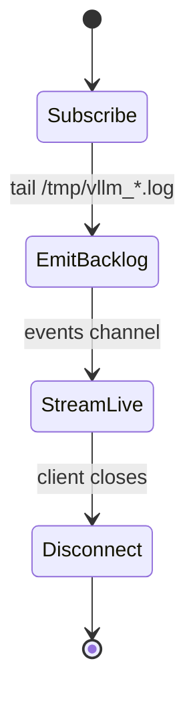
```mermaid
stateDiagram-v2
    [*] --> Subscribe
    Subscribe --> EmitBacklog: tail /tmp/vllm_*.log
    EmitBacklog --> StreamLive: events channel
    StreamLive --> Disconnect: client closes
    Disconnect --> [*]
```

### Event Broadcast Loop (`controller/events.py`)

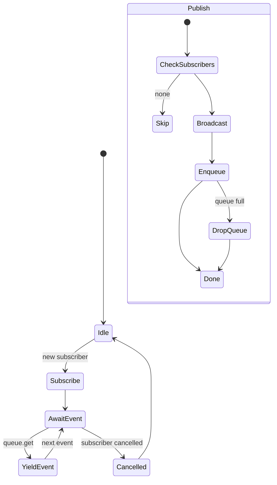
```mermaid
stateDiagram-v2
    [*] --> Idle
    Idle --> Subscribe: new subscriber
    Subscribe --> AwaitEvent

    AwaitEvent --> YieldEvent: queue.get
    YieldEvent --> AwaitEvent: next event

    AwaitEvent --> Cancelled: subscriber cancelled
    Cancelled --> Idle

    state Publish {
        [*] --> CheckSubscribers
        CheckSubscribers --> Skip: none
        CheckSubscribers --> Broadcast
        Broadcast --> Enqueue
        Enqueue --> DropQueue: queue full
        Enqueue --> Done
        DropQueue --> Done
    }
```

## Frontend State Maps

### Chat Streaming + Tool Loop (`frontend/src/app/api/chat/route.ts`, `frontend/src/app/chat/page.tsx`)

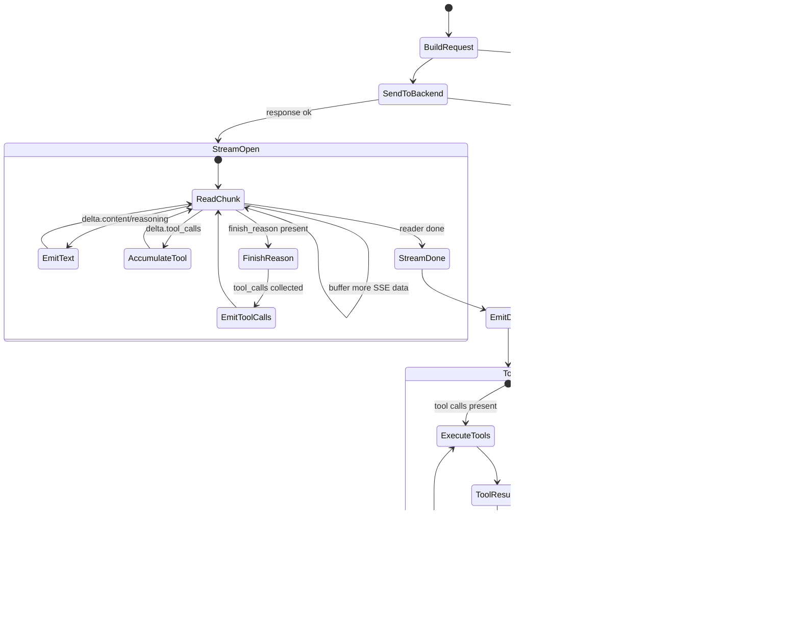
```mermaid
stateDiagram-v2
    [*] --> BuildRequest
    BuildRequest --> Reject: messages missing
    BuildRequest --> SendToBackend

    SendToBackend --> BackendError: non-200 response
    SendToBackend --> StreamOpen: response ok

    state StreamOpen {
        [*] --> ReadChunk
        ReadChunk --> ReadChunk: buffer more SSE data
        ReadChunk --> EmitText: delta.content/reasoning
        EmitText --> ReadChunk
        ReadChunk --> AccumulateTool: delta.tool_calls
        AccumulateTool --> ReadChunk
        ReadChunk --> FinishReason: finish_reason present
        FinishReason --> EmitToolCalls: tool_calls collected
        EmitToolCalls --> ReadChunk
        ReadChunk --> StreamDone: reader done
    }

    StreamDone --> EmitDone
    EmitDone --> ToolLoop

    state ToolLoop {
        [*] --> NoTools
        NoTools --> PersistAssistant: no tool calls
        [*] --> ExecuteTools: tool calls present
        ExecuteTools --> ToolResults
        ToolResults --> AppendToolMessages
        AppendToolMessages --> Resubmit: send new /api/chat
        Resubmit --> ExecuteTools
    }

    PersistAssistant --> [*]
    Reject --> [*]
    BackendError --> [*]
```

### SSE Subscription + Reconnect (`frontend/src/hooks/useSSE.ts`)

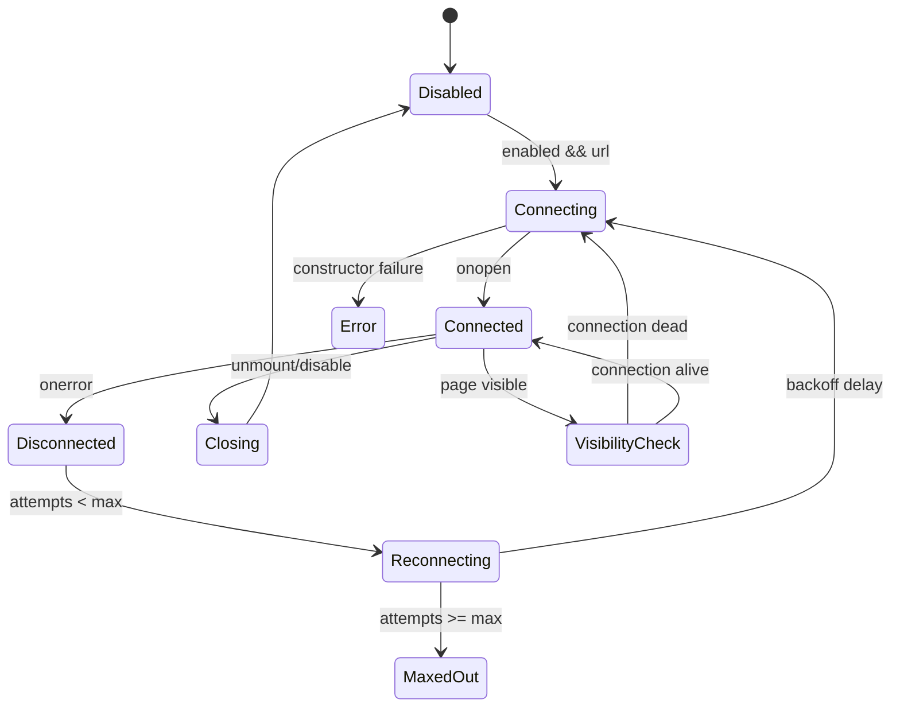
```mermaid
stateDiagram-v2
    [*] --> Disabled
    Disabled --> Connecting: enabled && url

    Connecting --> Connected: onopen
    Connecting --> Error: constructor failure

    Connected --> Disconnected: onerror
    Disconnected --> Reconnecting: attempts < max
    Reconnecting --> Connecting: backoff delay
    Reconnecting --> MaxedOut: attempts >= max

    Connected --> Closing: unmount/disable
    Closing --> Disabled

    Connected --> VisibilityCheck: page visible
    VisibilityCheck --> Connecting: connection dead
    VisibilityCheck --> Connected: connection alive
```

### Voice Recording + Transcription (`frontend/src/components/chat/tool-belt.tsx`, `frontend/src/app/api/voice/transcribe/route.ts`)

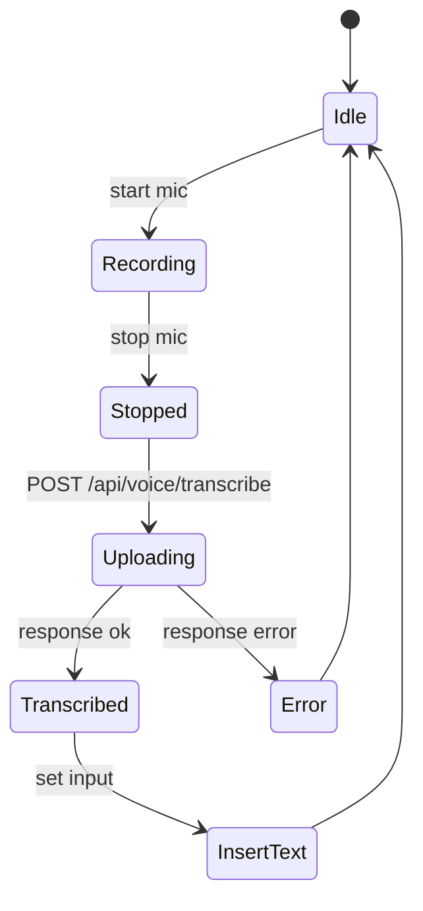
```mermaid
stateDiagram-v2
    [*] --> Idle
    Idle --> Recording: start mic
    Recording --> Stopped: stop mic
    Stopped --> Uploading: POST /api/voice/transcribe
    Uploading --> Transcribed: response ok
    Uploading --> Error: response error
    Transcribed --> InsertText: set input
    InsertText --> Idle
    Error --> Idle
```

### API Settings Load/Save (`frontend/src/app/configs/page.tsx`, `frontend/src/app/api/settings/route.ts`)

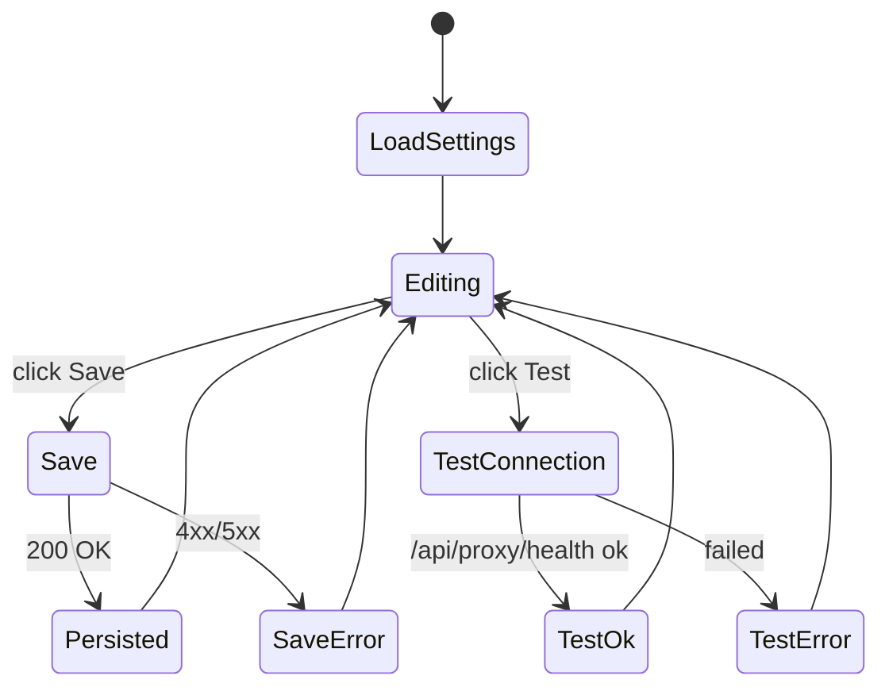
```mermaid
stateDiagram-v2
    [*] --> LoadSettings
    LoadSettings --> Editing
    Editing --> Save: click Save
    Save --> Persisted: 200 OK
    Save --> SaveError: 4xx/5xx
    Persisted --> Editing
    SaveError --> Editing
    Editing --> TestConnection: click Test
    TestConnection --> TestOk: /api/proxy/health ok
    TestConnection --> TestError: failed
    TestOk --> Editing
    TestError --> Editing
```

### Frontend Proxy Layer (`frontend/src/app/api/proxy/[...path]/route.ts`)

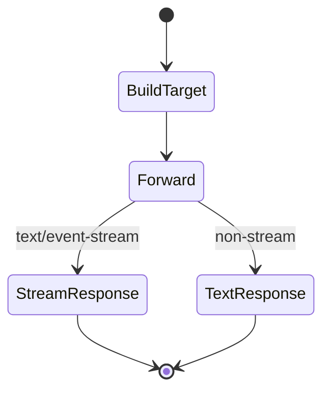
```mermaid
stateDiagram-v2
    [*] --> BuildTarget
    BuildTarget --> Forward
    Forward --> StreamResponse: text/event-stream
    Forward --> TextResponse: non-stream
    StreamResponse --> [*]
    TextResponse --> [*]
```

### Title Generation (`frontend/src/app/api/title/route.ts`)

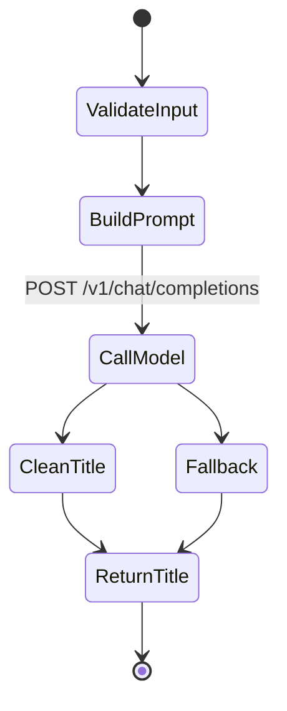
```mermaid
stateDiagram-v2
    [*] --> ValidateInput
    ValidateInput --> BuildPrompt
    BuildPrompt --> CallModel: POST /v1/chat/completions
    CallModel --> CleanTitle
    CleanTitle --> ReturnTitle
    CallModel --> Fallback
    Fallback --> ReturnTitle
    ReturnTitle --> [*]
```

## Config + Infra Maps

### Docker Compose Service Topology (`docker-compose.yml`)

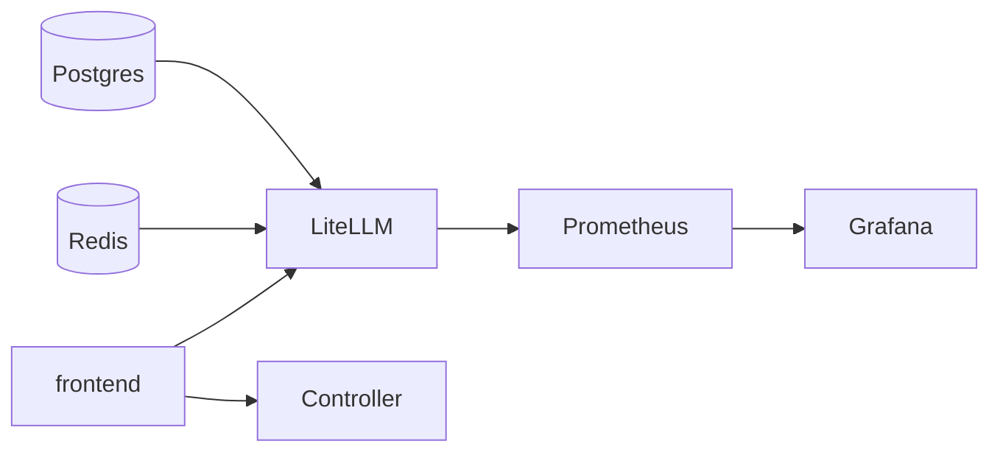
```mermaid
graph LR
    postgres[(Postgres)] --> litellm[LiteLLM]
    redis[(Redis)] --> litellm
    prometheus[Prometheus] --> grafana[Grafana]
    litellm --> prometheus
    frontend --> controller[Controller]
    frontend --> litellm
```

### LiteLLM Routing (`config/litellm.yaml`)

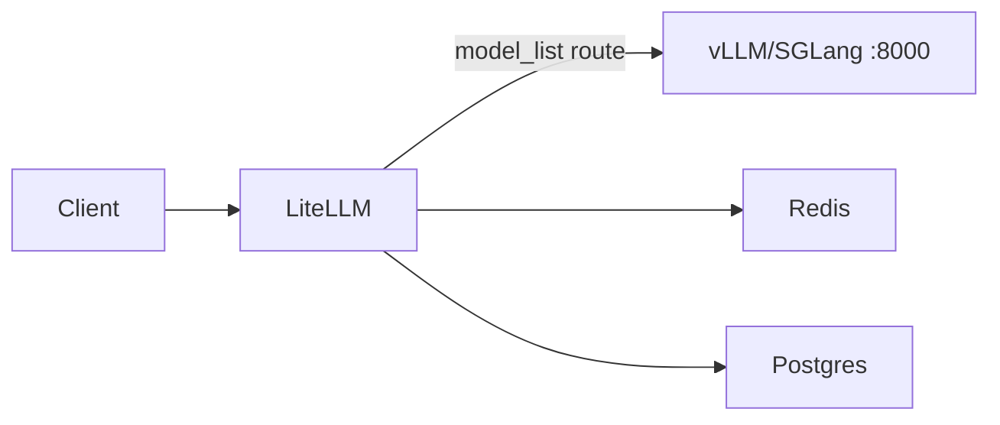
```mermaid
flowchart LR
    Client --> LiteLLM
    LiteLLM -->|model_list route| Inference[vLLM/SGLang :8000]
    LiteLLM --> Redis
    LiteLLM --> Postgres
```

## Dependency Surface (Non-Exhaustive)

- **Controller**: FastAPI, httpx, pydantic, sqlite3, psutil, pynvml, asyncpg.
- **Frontend**: Next.js, React, AI SDK, lucide-react, zod, tailwindcss.
- **Infra**: LiteLLM (Docker), PostgreSQL, Redis, Prometheus, Grafana.
- **Runtime CLI**: `vllm`/`sglang` binaries, MCP tools via `npx` or custom commands.
