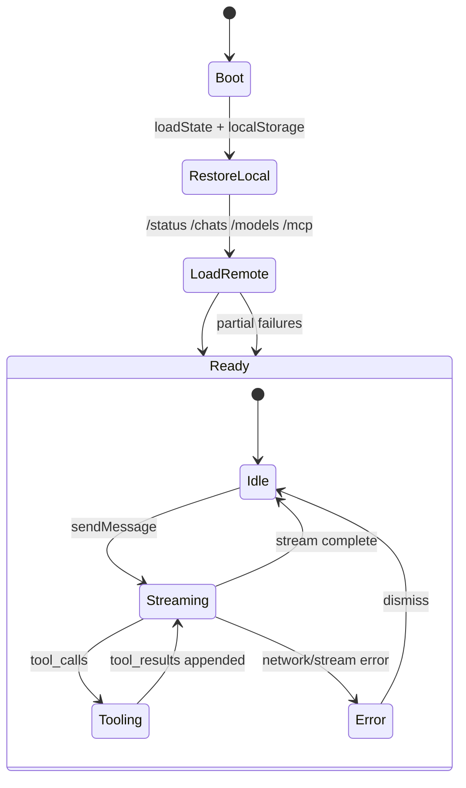
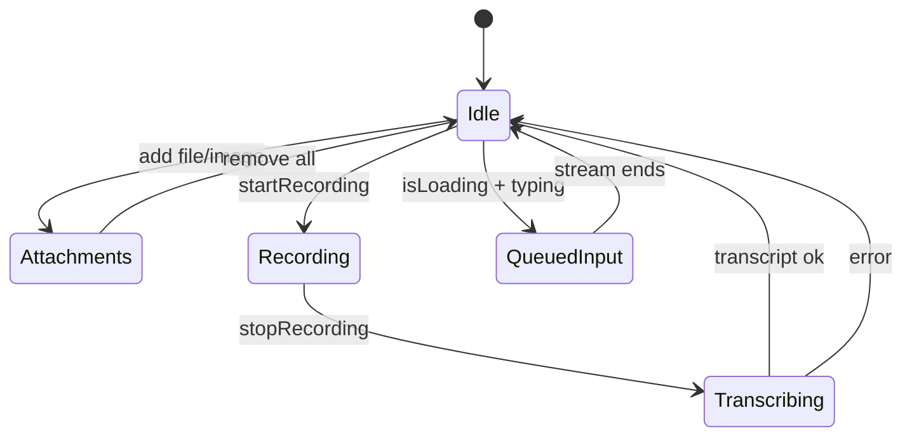
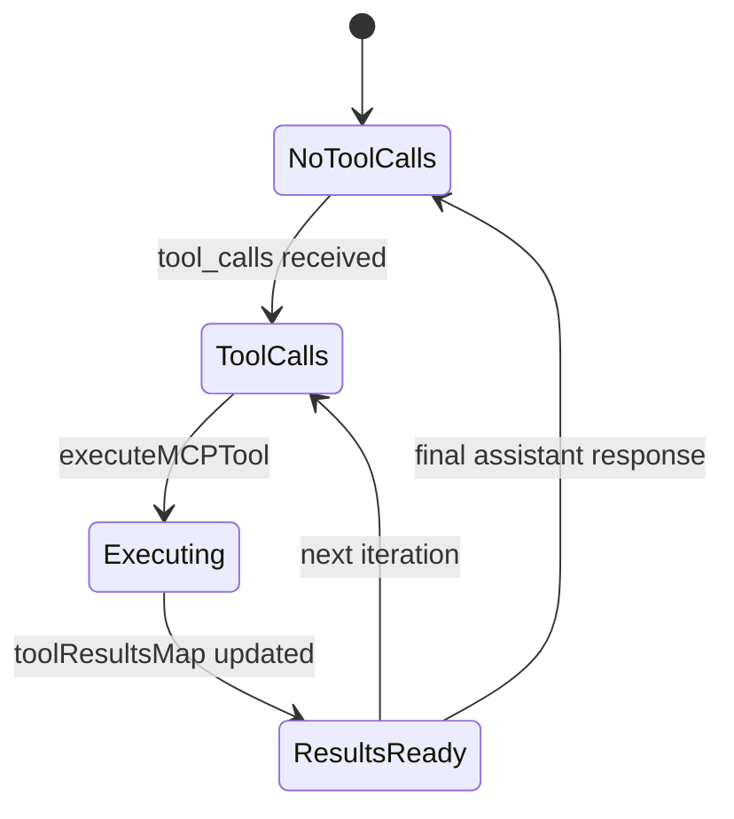
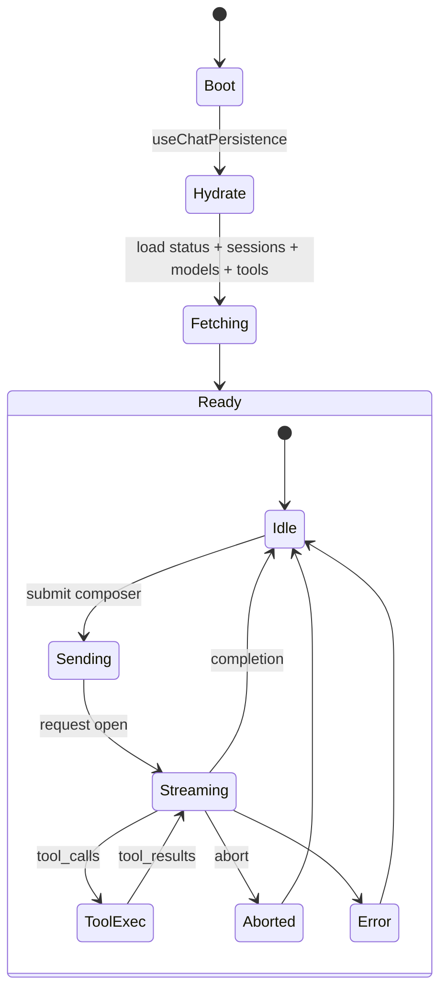
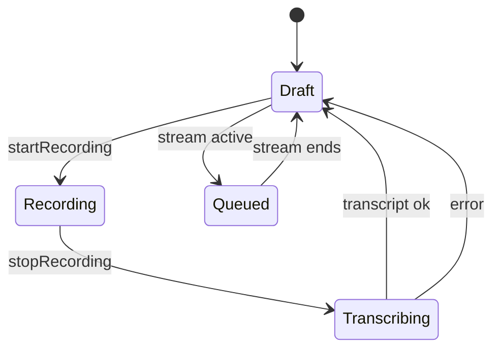
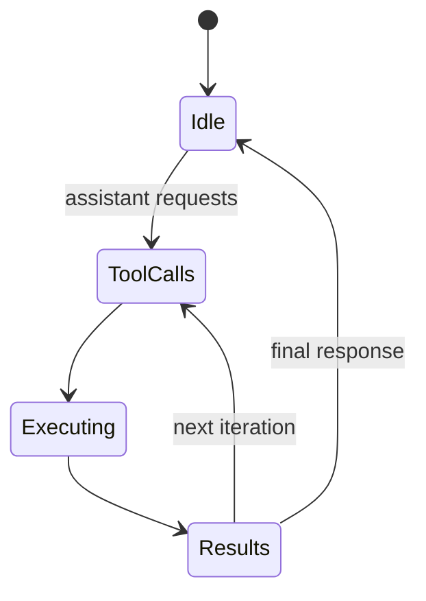

# Chat Page State Refactor Proposal

## Scope
- Focus: `frontend/src/app/chat/page.tsx` and its subcomponents.
- Included subcomponents (direct + nested):
  - `frontend/src/app/chat/components/ChatMessageList.tsx`
  - `frontend/src/app/chat/components/ChatSidePanel.tsx`
  - `frontend/src/app/chat/components/ChatMobileHeader.tsx`
  - `frontend/src/app/chat/components/ChatModals.tsx`
  - `frontend/src/components/chat/tool-belt.tsx`
  - `frontend/src/components/chat/mcp-settings-modal.tsx`
  - `frontend/src/components/chat/chat-settings-modal.tsx`
  - `frontend/src/components/chat/message-renderer.tsx`
  - `frontend/src/components/chat/artifact-panel.tsx`
  - `frontend/src/components/chat/artifact-renderer.tsx`
  - `frontend/src/components/chat/tool-call-card.tsx`
  - `frontend/src/components/chat/research-progress.tsx`
  - `frontend/src/components/chat/message-search.tsx`
  - `frontend/src/components/chat/context-indicator.tsx`
  - `frontend/src/hooks/useContextManager.ts`
  - `frontend/src/lib/chat-state-persistence.ts`

## Current State (Before)

### Chat Page State Inventory
| Group | State | Source | Why stored |
| --- | --- | --- | --- |
| Sessions | `sessions`, `currentSessionId`, `currentSessionTitle`, `sessionsLoading`, `sessionsAvailable` | `/chats`, `/chats/{id}` | Session list + selected session UI + fetch status |
| Messages | `messages` | `/chats/{id}`, `/api/chat` stream | Render conversation + tool calls + token counts |
| Composer | `input`, `queuedContext` | user input + localStorage | text draft + queue while streaming |
| Streaming | `isLoading`, `streamingStartTime`, `elapsedSeconds`, `error`, `abortControllerRef` | `/api/chat` stream | request lifecycle, cancel, timer, error display |
| Model | `runningModel`, `modelName`, `selectedModel`, `availableModels`, `pageLoading` | `/status`, `/v1/models` | model selection + boot gate |
| Tools/MCP | `mcpEnabled`, `mcpServers`, `mcpTools`, `mcpSettingsOpen`, `executingTools`, `toolResultsMap` | `/mcp/servers`, `/mcp/tools`, `/mcp/tools/{call}` | tool availability, execution status, results cache |
| Artifacts | `artifactsEnabled`, `sessionArtifacts`, `activePanel` | derived from `messages` | artifact previews + side panel context |
| Research | `deepResearch`, `researchProgress`, `researchSources` | localStorage + deep research flow | deep-research config + progress UI |
| Usage | `sessionUsage`, `usageDetailsOpen`, `exportOpen`, `usageRefreshTimerRef` | `/usage`, `/chats/{id}` | usage modal + export modal |
| UI / Layout | `copiedIndex`, `sidebarCollapsed`, `isMobile`, `toolPanelOpen`, `historyDropdownOpen`, `messageSearchOpen`, `userScrolledUp`, `bookmarkedMessages`, `editingTitle`, `titleDraft` | UI events | view-only UX state |
| Refs | `messagesEndRef`, `messagesContainerRef` | DOM refs | scrolling + anchor |
| Context Mgmt | `contextManager` state | `useContextManager` + localStorage | token tracking + compaction |

### Subcomponent Local State Inventory
| Component | Local State | Why stored |
| --- | --- | --- |
| `ToolBelt` | attachments, recording/transcribing state, TTS toggle, recording duration | local composer + speech input UX |
| `ChatSettingsModal` | local prompt, local deep research, fork selection | staged changes + modal isolation |
| `MCPSettingsModal` | local server list, add form, env pairs, saving/error | optimistic edits + form state |
| `ChatMobileHeader` | recent chat dropdown + search query | mobile UX |
| `MessageRenderer` | thinking expanded, mermaid render errors | rendering UX |
| `ArtifactPanel` | selected artifact | viewer UX |
| `ArtifactViewer` | fullscreen, show code, copy status, zoom/pan/run | artifact preview UX |
| `ArtifactRenderer` | preview toggle, fullscreen, show code, copy | message artifact UX |
| `ToolCallCard` | expanded state, modal state, copy | tool detail UX |
| `MessageSearch` | search query, filter, dropdown | search UX |
| `ResearchProgressIndicator` | expanded | progress UX |
| `ContextIndicator` | details/history/settings toggles | token UX |

### Data Sources & Persistence
- **API**
  - `/status`, `/v1/models` → model/running status.
  - `/chats`, `/chats/{id}`, `/chats/{id}/messages` → sessions + message history.
  - `/api/chat` → streaming assistant response.
  - `/mcp/servers`, `/mcp/tools`, `/mcp/tools/{call}` → tool registry + executions.
  - `/usage` → usage metrics.
  - `/api/title` → auto-title generation.
- **localStorage**
  - `vllm_chat_state` (chat draft + toggles) via `chat-state-persistence`.
  - `vllm-studio-system-prompt` (system prompt).
  - `vllm-studio-deep-research` (deep research settings).
  - `vllm_context_config`, `vllm_compaction_history` (context manager).
- **Derived**
  - `sessionArtifacts` derived from assistant messages.
  - `hasToolActivity`, `hasSidePanelContent`, `allToolCalls` derived from messages/executing tools.
- **Browser**
  - `window.innerWidth` for `isMobile` and `sidebarCollapsed`.
  - `navigator.mediaDevices` for voice input.
  - `navigator.clipboard` for copy actions.

### Why It Feels “Ridiculous”
- State is **flat** and **cross-cutting** (80+ lines of `useState`), making ownership unclear.
- **Persistence is scattered** (chat-state, system prompt, deep research, context manager).
- Many subcomponents maintain **duplicated local state** (e.g., staging in modals) with no unified lifecycle.
- Streaming, tool execution, and UI are **interleaved in one function** (`sendMessage`).

## Before State Machines

### Chat Page (Current High-Level)

### ToolBelt Composer (Current)

### Tool Execution Loop (Current)

## Proposed Refactor (After)

### State Grouping / Ownership
Move from “giant component state” to **slice-based ownership** with a single controller hook.

**Proposed hooks / slices** (examples):
- `useChatSession` → sessions list, current session, title edits.
- `useChatModel` → selected/running model + available models + status.
- `useChatComposer` → input draft, queued context, attachments, voice transcription.
- `useChatStream` → `isLoading`, timers, errors, abort handling.
- `useChatTools` → MCP toggle, servers, tools, execution results.
- `useChatArtifacts` → artifacts derived from messages + active panel.
- `useChatResearch` → deep research config + progress + sources.
- `useChatUsage` → usage stats + modal state.
- `useChatUI` → layout/modals/search/bookmarks/mobile state.
- `useChatContext` → `useContextManager` integration and settings.

Each hook owns:
- **source-of-truth data**
- **persistence policy** (localStorage vs runtime)
- **actions** that mutate only its slice

### Persistence Strategy
- Consolidate chat-level persistence to **one hook** (e.g. `useChatPersistence`).
- Normalize localStorage keys to a single namespace (e.g. `vllm_chat:*`).
- Keep modal staging in local component state (do not persist).

## After State Machines

### Chat Orchestration (Target)

### Composer (Target)

### Tool Execution (Target)

## Clean Boundaries (After)
- `ChatPage` coordinates **only** orchestration and passes slice props.
- Subcomponents receive **narrow props** and keep **only modal-local UX state**.
- Tool execution + streaming is isolated in `useChatStream` and `useChatTools`.
- Persistence and hydration consolidated in `useChatPersistence`.

## Suggested Next Steps
1. Extract `useChatSession` + `useChatModel` + `useChatStream` (highest churn).
2. Extract `useChatTools` + `useChatComposer` (ToolBelt + MCP).
3. Extract `useChatUI` + `useChatUsage` + `useChatArtifacts`.
4. Consolidate persistence and remove duplicate localStorage reads.
5. Update `ChatPage` to assemble slices and pass trimmed props.
